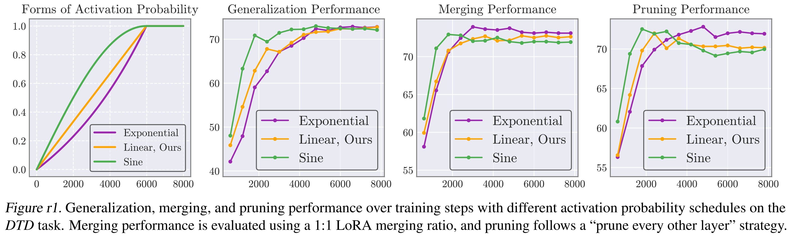
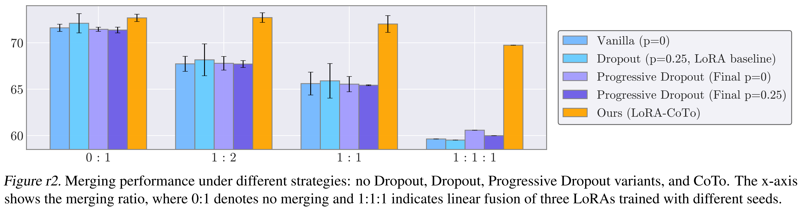
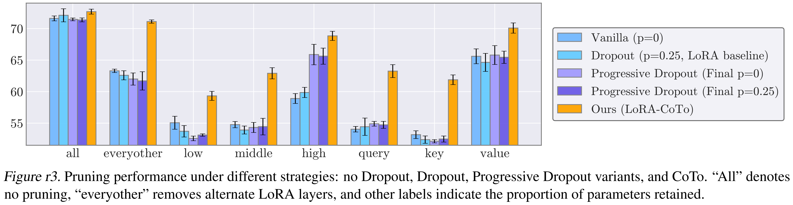
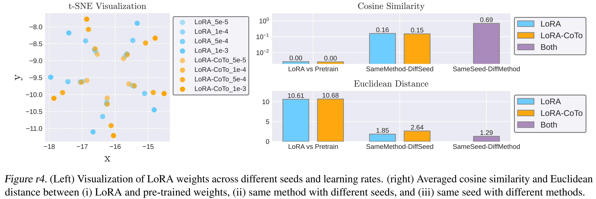
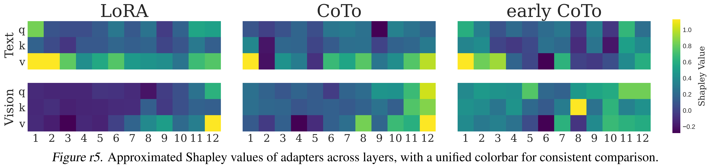
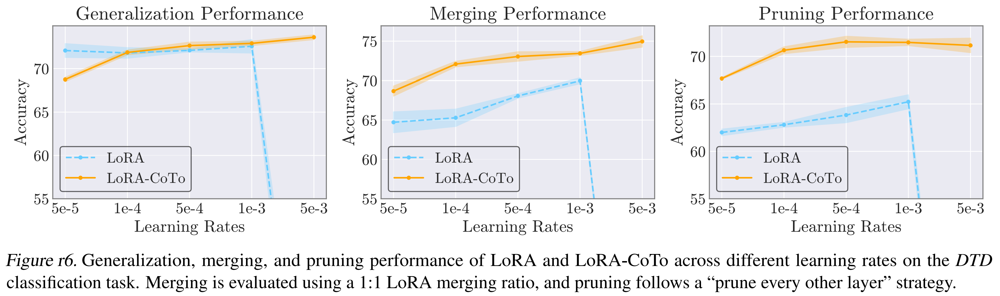
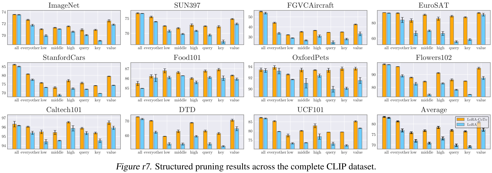
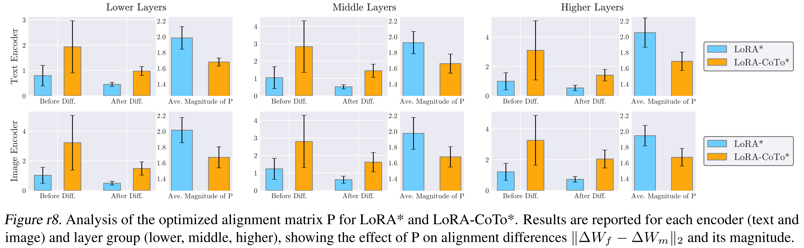
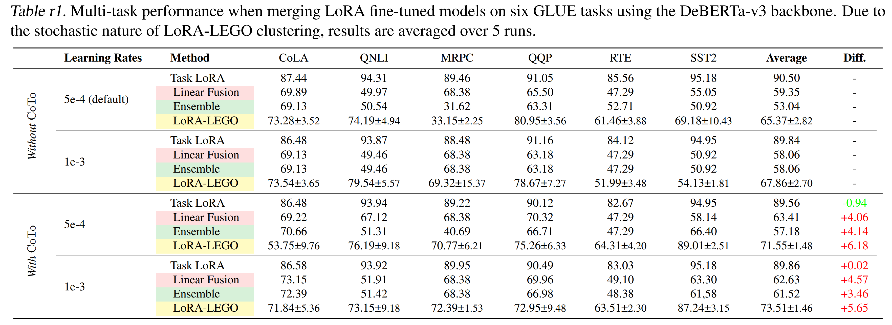
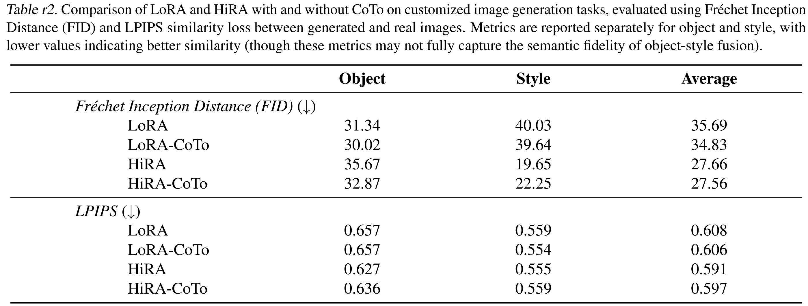

# ICML 2025 Rebuttal of CoTo (Supplement Figures and Tables)

####  Figure r1

####  Figure r2

####  Figure r3

####  Figure r4

####  Figure r5

####  Figure r6

####  Figure r7

####  Figure r8

####  Table r1:

####  Table r2:
