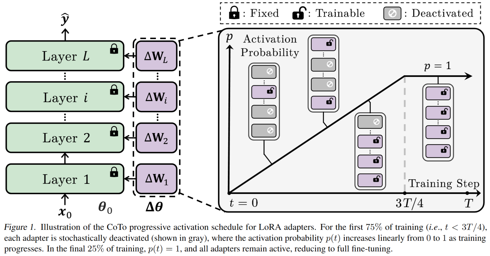

# 🧠 CoTo: Come Together, But Not Right Now

This repository provides the official implementation of **CoTo**, a progressive training strategy for Low-Rank Adaptation (LoRA). CoTo improves generalization, model merging, pruning robustness, and training efficiency by gradually activating LoRA adapters during fine-tuning.

📄 For details, check out our ICML 2025 paper (Coming soon).

📌 We plan to integrate CoTo into popular libraries like [Hugging Face PEFT](https://github.com/huggingface/peft) in future updates.

🧩 **Acknowledgments:** Our experiments build upon several excellent open-source libraries, including
 [CLIP-LoRA](https://github.com/MaxZanella/CLIP-LoRA), [LoRA-Pro](https://github.com/mrflogs/LoRA-Pro), [DoRA](https://github.com/NVlabs/DoRA), [HiRA](https://github.com/hqsiswiliam/hira), [ZipLoRA](https://github.com/mkshing/ziplora-pytorch), and [LoraRetriever](https://github.com/StyxXuan/LoraRetriever). We sincerely thank the authors for their contributions to the community.

🔧 We are currently working on releasing complete training and evaluation code to support reproducibility and future extensions.

---


## ✨ What is CoTo?

CoTo stochastically deactivates LoRA-style adapters in training and linearly increases their activation probability over time.



| Feature                          | Supported ✅ |
| -------------------------------- | ----------- |
| Progressive adapter activation   | ✅           |
| Balanced layer-wise optimization | ✅           |
| Improved adapter merging         | ✅           |
| Robustness to pruning            | ✅           |
| Compatible with LoRA variants    | ✅           |

---


## 🚀 How to Use CoTo in 3 Simple Steps

You can integrate CoTo into any LoRA-style pipeline with minimal changes.

---

### 🔧 Step 1: Modify Your LoRA Layer

Add a `cotodrop` flag to control activation during training:

```python
class LoraLayer(nn.Module):
    def __init__(self, ...):
        super().__init__()
        ...
        self.cotodrop = False  # Will be dynamically updated

    def forward(self, x: torch.Tensor, *args, **kwargs):
        if self.cotodrop:
            return self.base_layer(x, *args, **kwargs)  # Skip LoRA
        else:
            ...  # Standard LoRA logic
```

---

### 🧠 Step 2: Define the CoTo Scheduler Callback

```python
from transformers import TrainerCallback

def get_loras(target_modules, model):
    """Collect LoRA submodules based on name suffix matching."""
    return [
        module for name, module in model.named_modules()
        if any(name.endswith(t) for t in target_modules)
    ]

def generate_random_tensor(n, k):
    """Generate a tensor of length `n` with at least one value ≤ k."""
    while True:
        t = torch.rand(n)
        if not torch.all(t > k):
            return t

class CoToSchedulerCallback(TrainerCallback):
    """
    Dynamically updates the `cotodrop` flags for LoRA adapters based on training progress.
    """

    def __init__(self, adapter_modules, initial_p=0.1, final_p=1.0, stage1_ratio=0.75, module_num=2):
        self.loras = adapter_modules
        self.initial_p = initial_p
        self.final_p = final_p
        self.stage1_ratio = stage1_ratio
        self.module_num = module_num
        self.total_steps = None

    def on_train_begin(self, args, state, control, **kwargs):
        self.total_steps = state.max_steps
        self.update_dropout_rate(self.initial_p)

    def on_step_end(self, args, state, control, **kwargs):
        step = state.global_step
        end_step = math.ceil(self.total_steps * self.stage1_ratio)
        rate = self.initial_p + (self.final_p - self.initial_p) * (step / end_step)
        self.update_dropout_rate(min(rate, self.final_p))

    def update_dropout_rate(self, rate):
        group_count = len(self.loras) // self.module_num
        random_tensor = generate_random_tensor(group_count, rate)
        for i, lora in enumerate(self.loras):
            lora.cotodrop = random_tensor[i // self.module_num].item() > rate
```

---

### 📦 Step 3: Register the Callback in Your Trainer

```python
target_modules = ["q_proj", "v_proj"]  # Example
loras = get_loras(target_modules, model)
callbacks = [CoToSchedulerCallback(loras, initial_p=0.1, final_p=1.0, module_num=len(target_modules))]

trainer = Trainer(
    model=model,
    args=training_args,
    train_dataset=train_data,
    eval_dataset=eval_data,
    callbacks=callbacks,
)
```

---

## 🧪 Citation (Coming Soon)

If you use CoTo in your research, please cite:

```bibtex
@inproceedings{
zhuang2025come,
title={Come Together, But Not Right Now: A Progressive Strategy to Boost Low-Rank Adaptation},
author={Zhan Zhuang and Xiequn Wang and Wei Li and Yulong Zhang and Qiushi Huang and Shuhao Chen and Xuehao Wang and Yanbin Wei and Yuhe Nie and Kede Ma and Yu Zhang and Ying Wei},
booktitle={Forty-second International Conference on Machine Learning},
year={2025},
}
```